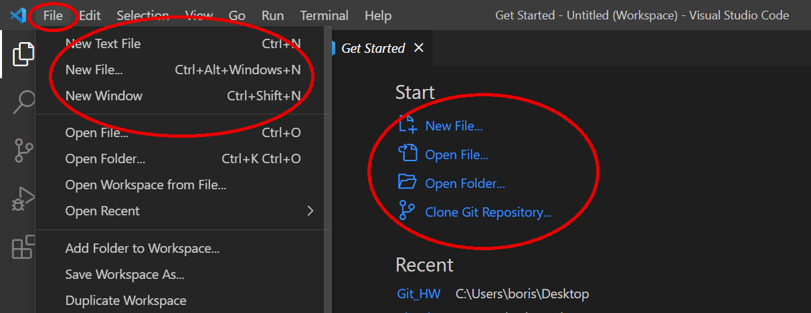
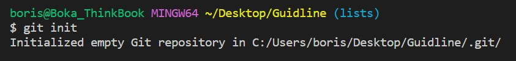
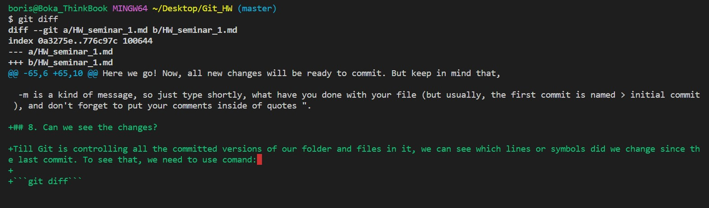
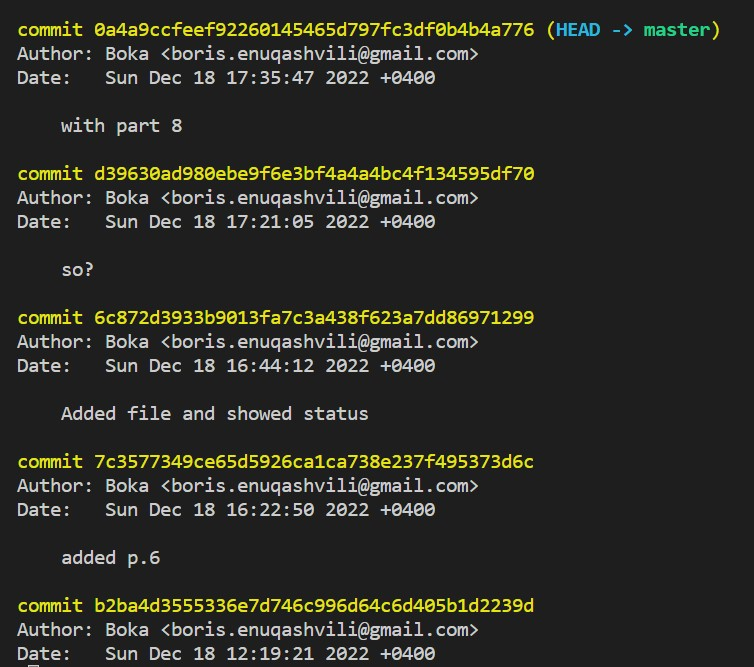
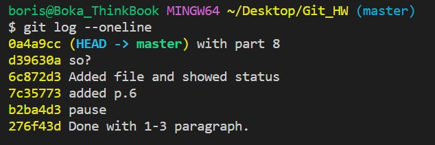

# Git instruction

## 1. Program availibility check: 
In a Visual code go to Terminal (Ctrl+`) and type the ```git version``` command, if Git is installed correctly, you will see its version (ex.: *git version 2.39.0.windows.1*), if not, you will see the error message and will have to install Git (go to paragraph 2). 
## 2. Installing Git:
Follow the link https://git-scm.com/downloads and download the version compatible with your device.
Install the program with default settings.
## 3. Introducing yourself to GIT: 
After installing the program, you have to introduce yourself to Git, so it'll know who's saving the versions.
To do that, you need to open Terminal (*in VS for example*) again (Ctrl+`) and run 2 commands:

```git config --global user.name «Your name with Latin letters»```

and

```git config --global user.email «Your e-mail» ```

Now Git knows you, and you can use all its abilities. To start controlling versions, first, you need to create a repository - folder, with the "magical" power of Git.

## 4. Creating a repository:
You can add an already existing folder under the Git control, or you can use the VC File menu to create a new folder\file.



*Don't forget to point out the file's extension after . if you are creating new file *(ex.: .md or .txt etc.)*

As an option, you can use the *Get Started* menu in VC if you just started working in it. 

## 5. Initializing repository

To inicialize versions tracking we have to inicialize our file, to do that just type in terminal (ctrl+` - if it's closed) command:

 ```git init```

 

 Here we go, Git knows which folder it has to track, but keep in mind, that the file's versions aren't recording yet.

 ## 6. Adding file

 Thins our file is already in the repository, we can check its status, to do that we use the command:

 ```git status```

 Probably, you will see the message, that you have 1 untracked file. To add our file for tracking, we need to use the command:

```git add [your file]```

*You can type only the first 4 symbols of your file's name and press the Tab button so Git will type it for you*

If you don't see any errors or mistakes, that means, that now our file is tracking, and we are ready to go.

After adding the file, we can check its status again, just to insure, that everything works.


Here we go! Now, all new changes will be ready to commit. But keep in mind that, **you have to save all the changes in the file by typing Ctrl + s or turn on the Auto save function through the File menu in VC.**

## 7. Committing your actions.

 We already know, how to add a file to the repository, but Git's magic still doesn't work properly - it just doesn't have any commits, so it can't understand which versions of the file you have. 
 After typing several lines, or even symbols, if you think that it's good enought to become one of the versions of your file, you will commit them by using the command:

 ```git commit -m "[your comment]"```

 -m is a kind of message, so just type shortly, what have you done with your file (but usually, the first commit is named > initial commit ), and don't forget to put your comments inside of quotes ".

***Don't forget to check git status sometimes, and if there are any issues, use the git add function before committing.***

## 8. Can we see the changes?

Till Git is controlling all the committed versions of our folder and files in it, we can see which lines or symbols did we change since the last commit. To see that, we need to use comand: 

```git diff```



So you can see the difference between the last committed and yet uncommitted version of your file, where added/changed/deleted lines are marked with different colors. 

## 9. Can we see commit's history? 

Now, when we have several commits we can see all of them with the changes and our comments. To do that just type and submit in the terminal command:

```git log``` 

You will see all your changes and commit details, like author, date, and comment. pay attention that all of the commits have their own hash number, due to which it can be identified. 




But if the history is too long and you just need to see it shorter, you always can use the command:

```git log --oneline```

In that case, you'll see only the beginning of the commit's number and your comment.

 *Don't forget to use "--" symbels before the > oneline atribute.*

 

## 10. Can we see only comments from previous versions? 

Git gives you the ability to switch between the versions of your file, so you will have all the committed versions safe, and you still can see one of the previous versions. To do that, you need the command git checkout and the first 4-7 numbers of the commit's hash number (you can check them by using ```git log --oneline``` command), for ex.: 

``` git checkout 276f43d ```

So you can switch between the versions, without harming any of them.

**Keep in mind, that in the switched version, logs will be valid only for that version, which was created before your recent one. To see the recent version you can use the ```git checkout - ``` command.**

## 11. Добавление изображения

Для добавления изображения, оно должно находиться в папке репозитории; Указывая символы  > ``` ! [ ] ( ) ``` мы добавляем изображение. внутри квадратных скобок ``` [ ] ``` пишем описание картинки, которое будет отображаться в случае, если картинка не загрузиться, а в круглых скобках ```( )``` указываем относительный путь изображения (можно скопировать кликнув правой кнопкой мыши на файл в проводнике VSC).

На пример:

 


Но файлы не принято отслеживать, поэтому чаще всего их добавляют в список игнорирования. Для создания списка игнорирования нужно создать в рабочей папке новый файл с названием ```.gitignore``` и в нем указать названия файлов для игнорирования с расширениями и каждый файл на отдельной строчке. Если мы все сделали правильно, то VSC подсветит их серым цветом и гит перестанет их отмечать как несохраненные.


Так-же мы можем добавить в игнорирование все файлы 1 типа, для этого в списке игнорирования указываем > *. и расширение файла (png/jpg и т.д.) 

```
*.png
```

## 12. Создание веток в Git

